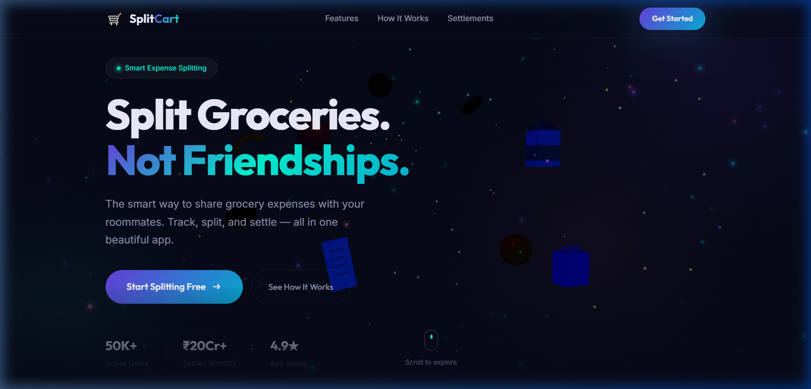
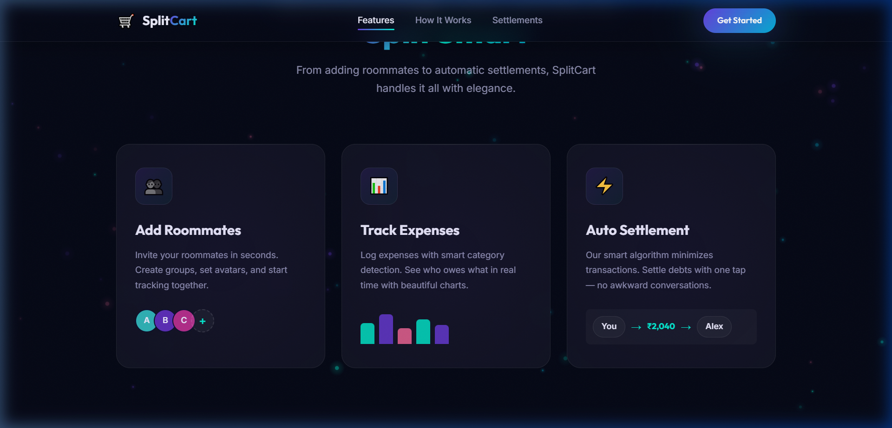
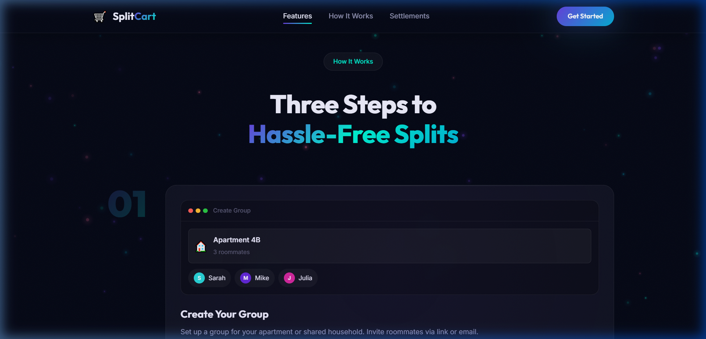
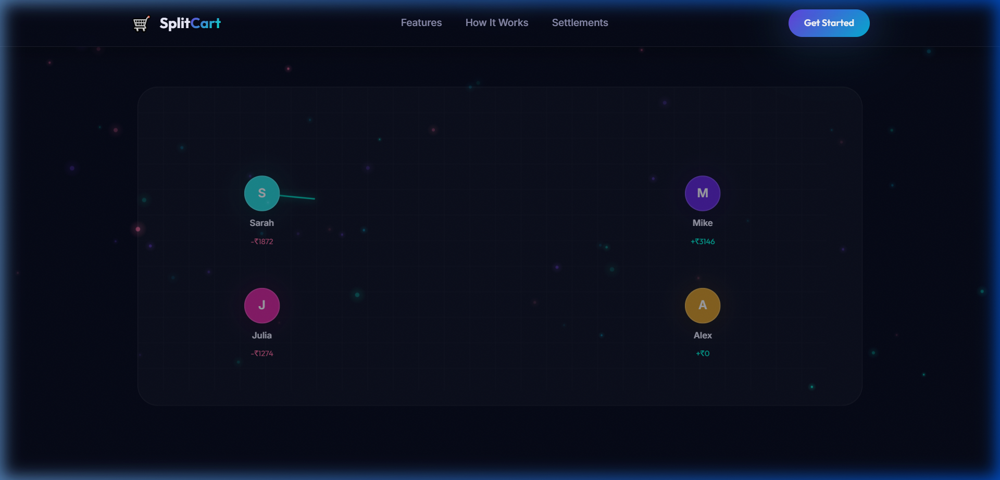
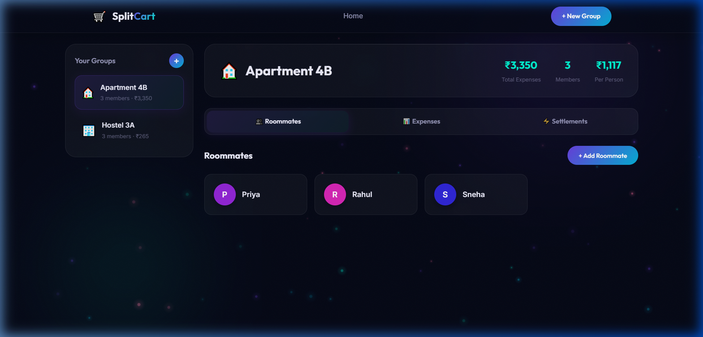
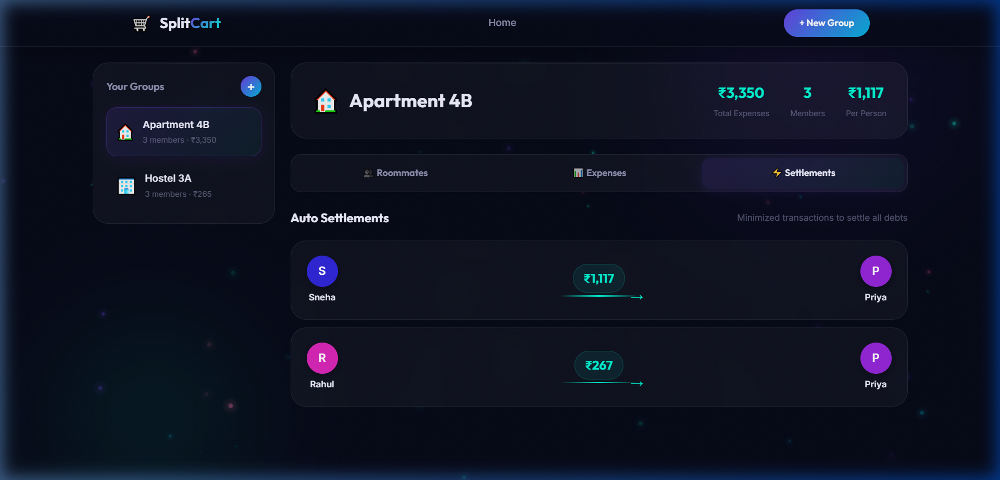

<div align="center">

# 🛒 SplitCart

### Smart Grocery Expense Splitter

**Split groceries with your roommates — not friendships.**

[](https://threejs.org/)
[](https://gsap.com/)
[](https://vitejs.dev/)
[](https://expressjs.com/)
[](LICENSE)

<br/>



<br/>

[**Live Demo**](#getting-started) · [**Features**](#-features) · [**Tech Stack**](#-tech-stack) · [**API Docs**](#-api-reference) · [**Contributing**](#-contributing)

</div>

---

## ✨ Overview

**SplitCart** is a premium, award-winning fintech web application for splitting grocery expenses with roommates. Featuring an immersive 3D WebGL landing page inspired by Apple, Stripe, and Awwwards-level design, combined with a fully functional backend-powered expense management dashboard.

- 🎯 **Track** shared grocery expenses in real time
- 👥 **Manage** roommates across multiple groups
- ⚡ **Auto-settle** debts with a smart algorithm that minimizes transactions
- 🇮🇳 **Built for India** with ₹ INR currency support

---

## 📸 Screenshots

<details>
<summary><b>Click to expand screenshots</b></summary>

<br/>

### Landing Page — Features


### How It Works — Step-by-Step


### Live Money Flow Visualization


### App Dashboard — Roommate Management


### Auto Settlements — Who Pays Whom


</details>

---

## 🚀 Features

### 🌐 Immersive Landing Page
| Feature | Description |
|---------|-------------|
| **3D Hero Scene** | Floating grocery objects (milk cartons, fruits, coins, receipts) built with Three.js |
| **Particle System** | Ambient canvas particles with glow effects and scroll parallax |
| **Scroll Animations** | Cinematic GSAP-powered reveal transitions for every section |
| **3D Tilt Cards** | Physics-based hover interactions with perspective transforms |
| **Money Flow Viz** | Real-time animated settlement graph with bezier curves and particle trails |
| **Glassmorphism UI** | Translucent glass panels with backdrop blur and subtle reflections |
| **Floating Gradient Orbs** | Animated depth layers for premium visual richness |

### 📊 Functional Dashboard
| Feature | Description |
|---------|-------------|
| **Group Management** | Create, switch, and delete expense groups |
| **Roommate Tracking** | Add/remove members with auto-generated color avatars |
| **Expense Logging** | Track expenses by category (Groceries, Dairy, Cleaning, etc.) |
| **Auto Settlement** | Smart algorithm minimizes transactions to settle all debts |
| **INR Currency** | All amounts displayed in Indian Rupees (₹) |
| **Persistent Storage** | Data saved to JSON file via Express.js backend |

---

## 🛠 Tech Stack

<div align="center">

| Layer | Technology |
|-------|-----------|
| **3D Graphics** | Three.js (WebGL) |
| **Animations** | GSAP + ScrollTrigger |
| **Frontend** | Vanilla JS (ES Modules) |
| **Styling** | Custom CSS (Glassmorphism, Gradients) |
| **Build Tool** | Vite |
| **Backend** | Express.js |
| **Database** | JSON File Storage |
| **Fonts** | Inter + Outfit (Google Fonts) |

</div>

---

## 📂 Project Structure

```
SplitCart/
├── index.html              # Landing page (3D hero, features, money flow)
├── app.html                # Dashboard SPA (groups, expenses, settlements)
├── package.json
│
├── src/
│   ├── main.js             # Landing page entry point
│   ├── app.js              # Dashboard frontend logic
│   ├── scene.js            # Three.js 3D hero scene
│   ├── animations.js       # GSAP scroll animations & interactions
│   ├── particles.js        # Ambient particle system
│   ├── moneyflow.js        # Settlement flow visualization
│   ├── style.css           # Shared design system & styles
│   └── app.css             # Dashboard-specific styles
│
├── server/
│   ├── index.js            # Express.js REST API
│   ├── db.js               # JSON database layer + settlement algorithm
│   └── data.json           # Persistent data (auto-generated)
│
├── public/
│   ├── favicon.svg
│   └── icons.svg
│
└── screenshots/            # README screenshots
```

---

## 🏁 Getting Started

### Prerequisites

- [Node.js](https://nodejs.org/) v18 or later
- npm (comes with Node.js)

### Installation

```bash
# 1. Clone the repository
git clone https://github.com/yourusername/splitcart.git
cd splitcart

# 2. Install dependencies
npm install
```

### Running the App

You need **two terminals** — one for the backend API and one for the frontend:

```bash
# Terminal 1: Start the backend API server (port 3001)
npm run server
```

```bash
# Terminal 2: Start the Vite dev server
npm run dev
```

Then open [http://localhost:5173](http://localhost:5173) in your browser.

---

## 📡 API Reference

The backend runs on `http://localhost:3001` and exposes the following REST API:

### Groups

| Method | Endpoint | Description |
|--------|----------|-------------|
| `GET` | `/api/groups` | List all groups |
| `POST` | `/api/groups` | Create a new group |
| `GET` | `/api/groups/:id` | Get group details (members, expenses, settlements) |
| `DELETE` | `/api/groups/:id` | Delete a group |

### Members

| Method | Endpoint | Description |
|--------|----------|-------------|
| `POST` | `/api/groups/:id/members` | Add a roommate to a group |
| `DELETE` | `/api/members/:id` | Remove a roommate |

### Expenses

| Method | Endpoint | Description |
|--------|----------|-------------|
| `POST` | `/api/expenses` | Add an expense |
| `DELETE` | `/api/expenses/:id` | Delete an expense |

### Settlements

| Method | Endpoint | Description |
|--------|----------|-------------|
| `GET` | `/api/groups/:id/settlements` | Calculate optimal settlements |

<details>
<summary><b>Example: Create a Group</b></summary>

```bash
curl -X POST http://localhost:3001/api/groups \
  -H "Content-Type: application/json" \
  -d '{"name": "Apartment 4B", "emoji": "🏠"}'
```

**Response:**
```json
{
  "id": 1,
  "name": "Apartment 4B",
  "emoji": "🏠",
  "created_at": "2026-03-16T15:00:00.000Z"
}
```
</details>

<details>
<summary><b>Example: Add an Expense</b></summary>

```bash
curl -X POST http://localhost:3001/api/expenses \
  -H "Content-Type: application/json" \
  -d '{"group_id": 1, "description": "Weekly groceries", "amount": 2500, "category": "groceries", "paid_by": 1}'
```
</details>

---

## 🧠 Settlement Algorithm

SplitCart uses a **greedy optimization algorithm** to minimize the number of transactions needed to settle all debts:

1. Calculate each member's **net balance** (what they paid minus their share)
2. Separate into **creditors** (owed money) and **debtors** (owe money)
3. Sort both lists by amount
4. Match largest debtor with largest creditor iteratively
5. Result: **minimum possible transactions** to settle everyone

```
Example:
  Priya paid ₹2,500 (share: ₹1,117) → owed ₹1,383
  Rahul paid ₹850 (share: ₹1,117) → owes ₹267
  Sneha paid ₹0 (share: ₹1,117) → owes ₹1,117

  Settlement:
  Sneha → Priya: ₹1,117
  Rahul → Priya: ₹267
```

---

## 🎨 Design Philosophy

The design draws inspiration from:

- **Apple** — Clean typography, generous whitespace, cinematic scroll storytelling
- **Stripe** — Gradient depth layers, glassmorphism, smooth micro-animations
- **Awwwards** — WebGL 3D scenes, parallax effects, premium fintech aesthetics

### Key Design Elements

- **Color Palette**: Midnight blue (`#0a0e27`), Purple (`#6c3ce0`), Neon Teal (`#00f5d4`)
- **Typography**: Outfit (headings) + Inter (body) from Google Fonts
- **Effects**: Floating gradient orbs, noise texture overlay, animated gradient borders
- **Glassmorphism**: `backdrop-filter: blur(20px)` with translucent backgrounds

---

## 🤝 Contributing

Contributions are welcome! Here's how:

1. **Fork** the repository
2. **Create** your feature branch (`git checkout -b feature/amazing-feature`)
3. **Commit** your changes (`git commit -m 'Add amazing feature'`)
4. **Push** to the branch (`git push origin feature/amazing-feature`)
5. **Open** a Pull Request

---

## 📄 License

This project is licensed under the **MIT License** — see the [LICENSE](LICENSE) file for details.

---

<div align="center">

**Made with ❤️ for roommates everywhere**

🛒 SplitCart © 2026

</div>
